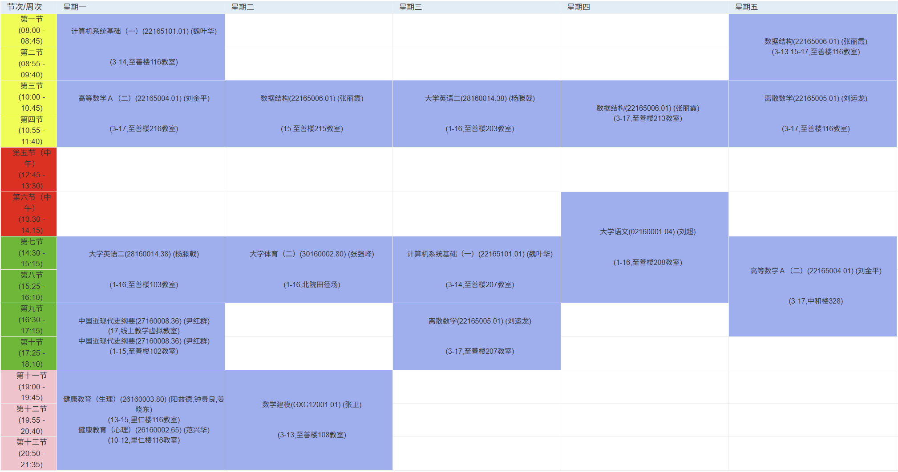

# 大一下学期｜学期总览

> 本页用于对大一下学期课程结构与相关资料页面进行统一导航。

---

## 🗂 本学期课程一览

本学期课程开始向专业基础阶段过渡，在延续数学课程的同时，引入多门核心计算机基础课程。

- 数学与理论基础课程：高等数学 A（二）、离散数学  
- 专业基础课程：数据结构、计算机系统基础（一）  
- 通识与语言课程：中国近现代史纲要、大学语文、大学英语（二）

---

## 🗺 课程结构示意（课表）

> 注：该课表仅用于展示课程结构与分布，不对应具体教学安排。

---

## 📚 资料导航

- [中国近现代史纲要](../courses/modern-chinese-history/index.zh.md)
- [数据结构](../courses/data-structures/index.zh.md)
- [离散数学](../courses/discrete-math/index.zh.md)
- [计算机系统基础（一）](../courses/cs-fundamentals-1/index.zh.md)
- [高等数学 A（二）](../courses/calculus-a-2/index.zh.md)
- [大学语文](../courses/chinese-language/index.zh.md)
- [大学英语（二）](../courses/college-english-2/index.zh.md)

相关笔记与资料已按课程分类整理在左侧导航栏中。
